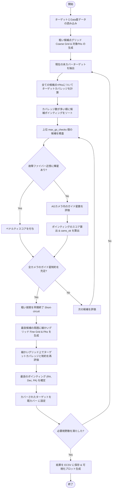

# PFS視野およびガイド星最適化スクリプト解説
(`optimize_hex_fov_with_guidestars.py` の動作とアルゴリズム)

本ドキュメントでは、[optimize_hex_fov_with_guidestars.py](file:///mnt/ugnas/work/PFS/galuda/netflow/src/netflow_by_user/optimize_hex_fov_with_guidestars.py) の処理概要、アルゴリズム、制約条件、主要な関数について詳しく解説します。

---

## 1. 概要
`optimize_hex_fov_with_guidestars.py` は、すばる望遠鏡の次世代超広視野多天体分光器 **PFS (Prime Focus Spectrograph)** の観測準備において、**「天体カバレッジ（観測可能な科学ターゲット数）の最大化」** と **「ガイド星（Guide Stars）の確保制約の充足」**、および **「故障ファイバー（Cobra）近傍の輝星回避」** を同時に満たす最適な望遠鏡ポインティング（中心座標 RA, Dec および視野回転角 PA）を決定するスクリプトです。

---

## 2. 主要な概念と制約条件

### 2.1. PFS 視野 (FoV) の表現
* PFS の視野は、天球上で外接円半径 $R_{\text{HEX}} = 0.69^\circ$（直径約 $1.3^\circ$）の**平坦な天頂部を持つ正六角形（Flat-topped Regular Hexagon）**としてモデル化されています。
* 視野回転角 (Position Angle: PA) が $0^\circ$ でない場合は、ターゲット座標（またはポインティング候補）を基準座標から回転させて判定を行います。

### 2.2. ガイド星 (Guide Stars) の選定制約
PFS は視野周辺部に **6 台のオートガイド（AG）カメラ** を備えています。観測中に望遠鏡のトラッキングを正確に維持するため、これらのカメラ視野内に十分な数のガイド星を導入する必要があります。
* **位置判定**: Gaia カタログの星の天球座標（RA, Dec）に固有運動（Proper Motion）および年周視差（Parallax）の補正を適用した上で、座標変換ツール `ctrans` (CoordinateTransform) を用いて、PFI（Prime Focus Instrument）の物理焦点面座標（AGカメラ座標系）へと投影します。
* **カメラ幾何構造**: `ets_shuffle.convenience.guidecam_geometry()` から取得した 6 枚の検出器ポリゴンを用いて内外判定を行います。
* **星の明るさ制限 (Magnitude Range)**: デフォルトでは $12.0 < G < 21.5$ 等の範囲にある星のみを有効なガイド星とみなします。
* **飽和防止**: カメラの視野内に極端に明るい星 ($G \le 12.0$ 等) が存在すると、センサーが飽和（Saturation）してガイドに悪影響を及ぼすため、そのポインティングは不適格（ペナルティ対象）となります。
* **近接星の排除**: ガイド星の誤認を防ぐため、他の星と $1.0\ \text{arcsec}$ 以内に隣接している近接星ペアは排除します。
* **カメラごとの充足数**: 各AGカメラに少なくとも `min_stars_per_cam` (デフォルト: 2つ) 以上のガイド星が存在し、かつそれが 6台のカメラのうち最低 `min_cams_with_stars` (デフォルト: 6台すべて) で満たされる必要があります。

### 2.3. 故障ファイバー近傍の輝星回避制約
PFS のファイバー位置決め装置（Cobra）のうち、故障したファイバー（Broken Fibers / Bad Cobras）の近くに明るい星（輝星）が位置すると、迷光（Stray Light）や不要なスペクトル混入、検出器への局所的な過大入力が発生するリスクがあります。
* **検出方法**: ポインティング $(RA, Dec, PA)$ に応じて、故障ファイバーの物理位置（PFI座標）を天球座標に逆投影します。
* **制約**: 逆投影された故障ファイバーの位置から `bright_star_radius_arcmin`（デフォルト: $1.5\ \text{arcmin}$）以内に、$G \le$ `bright_star_mag_limit`（デフォルト: $12.0$ 等）の輝星が入り込む場合、そのポインティング候補は**無効（選択不可）**として除外されます。

---

## 3. アルゴリズムと探索フロー
本スクリプトは、**「貪欲法 (Greedy Algorithm)」** に基づいて複数の視野 (FoV) を順次決定します。単一の FoV を最適化するステップは、計算効率を高めるために **「粗いグリッド探索 (Coarse Search)」** と **「細かい局所探索 (Fine Search/Refinement)」** の 2 段階（Coarse-to-Fine）で実行されます。



### ステップ 1: 粗い候補点グリッドの生成 (Coarse Grid Generation)
* 天体分布の境界 (Min/Max RA, Dec) から、外接六角形半径分（$0.5 \times R_{\text{HEX}}$）のバッファを持たせた領域を対象とします。
* `coarse_grid_step` (デフォルト $0.03^\circ$) で等間隔に配置したメッシュに加え、**天体自体の座標**もポインティング中心の候補として追加します。
* PA（視野回転角）は、六角形の $60^\circ$ 対称性を利用し、$[0^\circ, 60^\circ)$ の範囲を `pa_step` (デフォルト $5.0^\circ$) 刻みで探索します。

### ステップ 2: 高速カバレッジ評価 (Vectorized Coverage Evaluation)
* 候補数が非常に多いため、3次元配列によるメモリパンクを防ぐ目的で、候補点リストを `chunk_size` (デフォルト 5000) ずつに分割してループします。
* 各チャンク内では、NumPy によるベクトル化演算を用い、ターゲットを $-\text{PA}$ 回転させて正六角形の内外判定を行うことで、各候補の「新規カバー天体数」を高速にカウントします。

### ステップ 3: 粗い探索での制約チェックとスコアリング (Coarse Score & GS Constraints)
ターゲット数が多い上位 `max_gs_checks` (デフォルト 500) 個の候補に対し、以下の順で制約を検証します。
1. **故障ファイバー制約**: 輝星が故障ファイバーの許容半径内にある場合はスコアを最悪値に設定。
2. **ガイド星選定**: 6台のAGカメラそれぞれにおける有効ガイド星数を求めます。
3. **スコアリング**: 次の数式でポインティングを評価します。
   $$\text{Score} = N_{\text{targets}} - 1,000,000 \times \max(0, N_{\text{min\_cams}} - N_{\text{cams\_ok}})$$
   * $N_{\text{targets}}$: カバー天体数
   * $N_{\text{min\_cams}}$: 必要とする最低カメラ台数 (デフォルト: 6)
   * $N_{\text{cams\_ok}}$: ガイド星基準を満たしたカメラ台数
4. **早期終了 (Short-circuit)**:
   ソート順にチェックしているため、もしペナルティが 0 （＝全てのガイド星制約を完全に満たした）のポインティングが見つかれば、それ以降の候補をチェックしてもこれより高いスコア（カバー天体数）は得られないため、探索を打ち切って次のステップへ進みます。

### ステップ 4: 局所微調整 (Local Refinement / Fine Search)
粗い探索で得られた最良ポインティングの周囲を細かく探索し、より多くの天体をカバーしつつ制約を満たす位置へ最適化します。
* **探索範囲**: 粗いメッシュ間隔の $1.2$ 倍の範囲。
* **グリッド間隔**: `fine_grid_step` (デフォルト $0.002^\circ$)。
* **PA範囲**: 粗い探索で選ばれた $\text{PA} \pm 5.0^\circ$ を $0.5^\circ$ 刻みで探索。
* 局所探索でさらにスコアが改善するポインティングが見つかれば、それを最終的なポインティングとして採用します。

---

## 4. 主要な関数の解説

### [is_inside_hexagon_single](file:///mnt/ugnas/work/PFS/galuda/netflow/src/netflow_by_user/optimize_hex_fov_with_guidestars.py#L25-L40)
```python
def is_inside_hexagon_single(ra, dec, center_ra, center_dec, r, pa_deg):
```
単一の天体が回転する六角形内部に含まれるか判定します（主にプロット検証用）。
1. 天体と中心との差 $\Delta RA$ に $\cos(\text{Dec})$ の補正を掛け、フラットな平面座標系 $(\Delta x, \Delta y)$ を算出。
2. PA に応じて座標を反時計回りに回転させ、PAが $0^\circ$ の六角形領域判定式にかけます。

### [evaluate_candidates_chunk](file:///mnt/ugnas/work/PFS/galuda/netflow/src/netflow_by_user/optimize_hex_fov_with_guidestars.py#L63-L101)
```python
def evaluate_candidates_chunk(ra, dec, cand_ra, cand_dec, pa_deg, chunk_size=5000):
```
多数のポインティング候補に対して、ターゲット天体が六角形内に含まれる数を一括計算します。メモリ節約のため `chunk_size` に分割して NumPy ベクトル演算を行い、各ポインティング候補がカバーする天体数の配列を返します。

### [evaluate_guidestars_single](file:///mnt/ugnas/work/PFS/galuda/netflow/src/netflow_by_user/optimize_hex_fov_with_guidestars.py#L103-L190)
```python
def evaluate_guidestars_single(ra_tel, dec_tel, pa_tel, df_gaia, obstime,
                               min_mag=12.0, max_mag=21.5, minsep_arcsec=1.0):
```
特定のポインティングにおいて、6台のAGカメラそれぞれに入る有効なガイド星の数をカウントし、ガイド星のテーブルを抽出します。
1. Telescope 中心から半径約 $1.1^\circ$ 以内の Gaia 星を大まかにプリフィルタリング。
2. `pfs.utils.coordinates.CoordTransp.CoordinateTransform` (`mode="sky_pfi_ag"`) を使用し、Proper Motion / Parallax を考慮しつつ、AGカメラ物理座標（PFIミリメートル単位）へ変換。
3. 6台のAGカメラポリゴン領域（少し拡大したもの）を用いて、飽和の原因となる輝星 ($G \le 12.0$) がないか確認。あれば該当カメラカウントを `-999` にします。
4. `flag_close_pairs` で $1.0\ \text{arcsec}$ 未満の近接星を除外。
5. 等級フィルタリング（$12.0 < G < 21.5$）を行い、最終的に各カメラ領域の正確な境界線内に位置するガイド星数をカウントします。

### [check_bright_stars_near_broken_fibers](file:///mnt/ugnas/work/PFS/galuda/netflow/src/netflow_by_user/optimize_hex_fov_with_guidestars.py#L204-L256)
```python
def check_bright_stars_near_broken_fibers(c_ra, c_dec, c_pa, df_gaia, obstime, bench, radius_deg=1.5/60.0, max_mag=12.0):
```
故障したファイバーの近傍に輝星が存在するかどうかをチェックします。
1. `bench.cobras.centers[~bench.cobras.isGood]` から故障ファイバーの物理位置 (PFI座標) を取得。
2. `ctrans` の `mode="pfi_sky"` を用いて、故障ファイバーの物理位置を天球上の RA, Dec に逆変換。
3. 逆投影された各故障ファイバー座標と、カタログ内の輝星 ($G \le 12.0$) との角距離を計算。
4. 閾値（デフォルト $1.5\ \text{arcmin}$）未満に輝星が存在すれば `True` (衝突あり) を返します。

### [optimize_fovs_with_guidestars](file:///mnt/ugnas/work/PFS/galuda/netflow/src/netflow_by_user/optimize_hex_fov_with_guidestars.py#L258-L508)
上記で定義した関数群を組み合わせ、複数の FoV の最適化ポインティングを順番に（貪欲法を用いて）解くメインの最適化ループです。

---

## 5. コマンドライン引数と構成ファイル (YAML)

スクリプトは直接コマンドライン引数からパラメータを受け取ることができるほか、`--config / -c` オプションを介して YAML 形式の設定ファイルを読み込むことができます。

| 引数名 / YAML キー | デフォルト値 | 説明 |
| :--- | :--- | :--- |
| `--input` / `science_targets` | `cosmos/targets_all_20260514.csv` | 観測対象のサイエンスターゲットリスト (CSV) |
| `--gaia-catalog` / `gaia_catalog` | `cosmos/gaia.ecsv` | ガイド星選定用の Gaia カタログ (ECSV) |
| `--obstime` / `obstime` | `2026-05-09T06:00:00Z` | 観測開始日時 (UTC)。固有運動の補正や座標変換の計算に使用 |
| `--min-stars-per-cam` / `min_stars_per_cam` | `2` | 各AGカメラに必要な最小ガイド星数 |
| `--min-cams-with-stars` / `min_cams_with_stars` | `6` | 最小ガイド星数を満たすべき最低カメラ台数 |
| `--max-priority` / `max_priority` | `2` | 最適化対象とするターゲットの最大優先度（数値が小さいほど高優先） |
| `--num-fovs` / `num_fields` | `1` | 配置を試みる総 FoV 数 |
| `--pa-step` / `pa_step` | `5.0` | 粗い探索時における PA (視野角) のステップ幅 (deg) |
| `--max-gs-checks` / `max_gs_checks` | `500` | ガイド星評価にかける、カバレッジ上位候補の最大チェック数 |
| `--guidestar-mag-min` / `mag_min` | `12.0` | ガイド星として許容する最小(最も明るい)等級 |
| `--guidestar-mag-max` / `mag_max` | `21.5` | ガイド星として許容する最大(最も暗い)等級 |
| `--bright-star-mag-limit` / `bright_star_mag_limit`| `12.0` | 故障ファイバー近傍で回避すべき輝星の閾値等級 |
| `--bright-star-radius-arcmin`/`bright_star_radius_arcmin`| `1.5` | 故障ファイバー近傍で輝星を回避する半径 (arcmin) |
| `--output` / `pointing_file` | `optimized_pointings_with_gs.ecsv` | 最適化されたポインティング結果を出力するファイル名 |
| `--plot` / `fov_plot_file` | `optimized_coverage_with_gs.png` | 生成される可視化プロット画像名 |

---

## 6. 出力と可視化

### 6.1. 出力ファイル (ECSV)
最適化が完了すると、結果は [ECSV 形式](file:///mnt/ugnas/work/PFS/galuda/netflow/optimized_pointings_with_gs.ecsv) で保存されます。
保存されるテーブルには以下のカラムが含まれます：
* `ppc_code`: 視野コード (例: `OPT_FOV_1`)
* `ppc_ra`: 視野中心の RA (deg)
* `ppc_dec`: 視野中心の Dec (deg)
* `ppc_pa`: 視野の回転角 PA (deg)
* `covered_count`: その視野に収まる新規ターゲット天体数

### 6.2. 可視化プロット (PNG)
[optimized_coverage_with_gs.png](file:///mnt/ugnas/work/PFS/galuda/netflow/optimized_coverage_with_gs.png) などの名前で、最適化された結果が画像として出力されます。
プロットには以下の要素が描画されます：
1. **ターゲット天体**: カバーされた天体（視野ごとに色分け）およびカバーされなかった天体（灰色）。
2. **PFS 六角形視野**: 最適化された各ポインティングの中心に配置された正六角形（水色）。
3. **AGカメラ視野**: 各ポインティングに対応する 6 つの AG カメラ検出器の物理形状ポリゴン（緑色点線）とカメラID (`AG0` - `AG5`)。
4. **選択されたガイド星**: AGカメラ内で実際にガイド用として選出された Gaia 星（黄色の星マーク $\star$）。
5. **統計情報**: 優先度レベル (P0, P1, P2 等) ごとの天体カバレッジ率がタイトル部分に表示されます。

<!-- Mermaid JS rendering support -->
<script type="module">
  import mermaid from 'https://cdn.jsdelivr.net/npm/mermaid@10/dist/mermaid.esm.min.mjs';
  mermaid.initialize({ startOnLoad: false });
  document.addEventListener('DOMContentLoaded', async () => {
    const elements = document.querySelectorAll('pre code.language-mermaid');
    for (const codeEl of elements) {
      const preEl = codeEl.parentElement;
      const div = document.createElement('div');
      div.className = 'mermaid';
      div.textContent = codeEl.textContent;
      preEl.replaceWith(div);
    }
    await mermaid.run();
  });
</script>

<!-- MathJax JS rendering support -->
<script>
  window.MathJax = {
    tex: {
      inlineMath: [['$', '$'], ['\\(', '\\)']],
      displayMath: [['$$', '$$'], ['\\[', '\\]']]
    },
    options: {
      ignoreHtmlClass: 'tex2jax_ignore',
      processHtmlClass: 'tex2jax_process'
    }
  };
</script>
<script id="MathJax-script" async src="https://cdn.jsdelivr.net/npm/mathjax@3/es5/tex-mml-chtml.js"></script>
