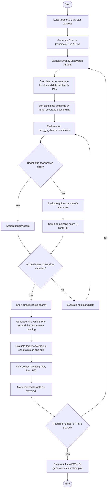

# PFS Field of View and Guide Star Optimization Script Explanation
(Behavior and Algorithm of `optimize_hex_fov_with_guidestars.py`)

This document provides a detailed explanation of the workflow, algorithm, constraints, and key functions in [optimize_hex_fov_with_guidestars.py](file:///mnt/ugnas/work/PFS/galuda/netflow/src/netflow_by_user/optimize_hex_fov_with_guidestars.py).

---

## 1. Overview
`optimize_hex_fov_with_guidestars.py` is a script designed for PFS (Prime Focus Spectrograph) observation planning. It determines the optimal telescope pointings (center coordinates RA, Dec, and Position Angle PA) by simultaneously achieving two goals:
1. **Maximizing Target Coverage**: Placing the field of view (FoV) to capture the maximum number of science targets.
2. **Satisfying Guide Star Constraints**: Ensuring enough guide stars are in the Auto Guide (AG) camera footprints.
3. **Avoiding Bright Stars near Broken Fibers**: Ensuring bright stars do not fall near broken fibers (bad Cobras) to prevent stray light and damage.

---

## 2. Key Concepts & Constraints

### 2.1. PFS Field of View (FoV) Representation
* The PFS FoV is modeled as a **flat-topped regular hexagon** with an outer radius $R_{\text{HEX}} = 0.69^\circ$ (diameter of approximately $1.3^\circ$).
* When the Position Angle (PA) is non-zero, the target coordinates (or candidate centers) are rotated relative to the center to perform inclusion checks.

### 2.2. Guide Star Constraints
PFS has **6 Auto Guide (AG) cameras** located around the perimeter of the focal plane. To maintain accurate telescope tracking, sufficient guide stars must be available in these camera footprints.
* **Position Projection**: Gaia stars from a query catalog are corrected for proper motion and parallax, then projected from sky coordinates (RA, Dec) to PFI (Prime Focus Instrument) physical coordinates using the `ctrans` tool (CoordinateTransform) with `mode="sky_pfi_ag"`.
* **Camera Geometry**: Point-in-polygon checks are performed using the detector geometries retrieved from `ets_shuffle.convenience.guidecam_geometry()`.
* **Magnitude Range**: By default, only stars with $12.0 < G < 21.5$ magnitude are considered valid guide stars.
* **Saturation Prevention**: Extremely bright stars ($G \le 12.0$) falling inside the exact boundaries of any AG camera can cause detector saturation, disqualifying the pointing (assigning a large penalty).
* **Close Neighbor Elimination**: To prevent guide star mismatching, stars within $1.0\ \text{arcsec}$ of another star are discarded using `ets_shuffle.convenience.flag_close_pairs`.
* **Camera Requirements**: Each AG camera must have at least `min_stars_per_cam` (default: 2) guide stars, and this must be satisfied in at least `min_cams_with_stars` cameras (default: all 6 cameras).

### 2.3. Bright Star Avoidance near Broken Fibers
If a bright star ($G \le \text{bright_star_mag_limit}$, default: 12.0) falls near a broken fiber (bad Cobra), it can create stray light, cause detector saturation, or damage the instrument.
* **Detection**: The physical positions of broken fibers (PFI coordinates) are back-projected to sky coordinates (RA, Dec) for a given pointing $(RA, Dec, PA)$.
* **Constraint**: If any bright star is found within `bright_star_radius_arcmin` (default: $1.5\ \text{arcmin}$) of a projected broken fiber, the candidate pointing is flagged as **invalid** and rejected.

---

## 3. Algorithm and Search Flow
The script uses a **Greedy Algorithm** to place multiple FoVs sequentially. For each FoV, a **Coarse-to-Fine Search** is executed to optimize efficiency.



### Step 1: Coarse Grid Generation
* Defines a grid of telescope coordinates spanning the target distribution plus a buffer of $0.5 \times R_{\text{HEX}}$.
* Mesh grid spacing is defined by `coarse_grid_step` (default: $0.03^\circ$). The coordinates of the **target stars themselves** are also appended to the candidate list.
* PAs are generated in $[0^\circ, 60^\circ)$ with a step of `pa_step` (default: $5.0^\circ$), leveraging the $60^\circ$ rotational symmetry of the regular hexagon.

### Step 2: Vectorized Target Coverage
* Candidates are processed in chunks of `chunk_size` (default: 5000) to prevent memory issues.
* For each chunk, NumPy vectorized operations rotate targets by $-\text{PA}$ to calculate the number of targets covered by each candidate pointing.

### Step 3: Constraint Verification & Scoring
The top `max_gs_checks` (default: 500) candidates are verified:
1. **Broken Fiber Avoidance**: Disqualifies the pointing if a bright star is too close to any bad Cobra.
2. **Guide Star Validation**: Evaluates guide star counts for all 6 AG cameras.
3. **Scoring**: Pointings are scored using:
   $$\text{Score} = N_{\text{targets}} - 1,000,000 \times \max(0, N_{\text{min\_cams}} - N_{\text{cams\_ok}})$$
   * $N_{\text{targets}}$: Number of covered science targets.
   * $N_{\text{min\_cams}}$: Minimum required camera count (default: 6).
   * $N_{\text{cams\_ok}}$: Number of cameras satisfying the guide star count.
4. **Short-circuiting**: Since candidates are sorted by target coverage, the first candidate with 0 penalty (fully satisfying guide star constraints) is guaranteed to be optimal. The coarse loop is immediately terminated.

### Step 4: Fine Search (Local Refinement)
* Searches a local region ($1.2 \times$ coarse step size) centered on the best coarse pointing.
* Uses a finer grid spacing `fine_grid_step` (default: $0.002^\circ$) and PA step size ($0.5^\circ$ within $\text{best\_PA} \pm 5.0^\circ$).
* If refinement yields a higher score, the pointing parameters are updated.

---

## 4. Key Functions

### [is_inside_hexagon_single](file:///mnt/ugnas/work/PFS/galuda/netflow/src/netflow_by_user/optimize_hex_fov_with_guidestars.py#L25)
```python
def is_inside_hexagon_single(ra, dec, center_ra, center_dec, r, pa_deg):
```
Determines if a single target is inside a rotated hexagon (used for verification and plotting).

### [evaluate_candidates_chunk](file:///mnt/ugnas/work/PFS/galuda/netflow/src/netflow_by_user/optimize_hex_fov_with_guidestars.py#L63)
```python
def evaluate_candidates_chunk(ra, dec, cand_ra, cand_dec, pa_deg, chunk_size=5000):
```
Performs vectorized, chunked computations to count target coverage inside the rotated hexagonal FoV for multiple candidates.

### [evaluate_guidestars_single](file:///mnt/ugnas/work/PFS/galuda/netflow/src/netflow_by_user/optimize_hex_fov_with_guidestars.py#L103)
```python
def evaluate_guidestars_single(ra_tel, dec_tel, pa_tel, df_gaia, obstime,
                               min_mag=12.0, max_mag=21.5, minsep_arcsec=1.0):
```
Calculates guide star availability for a single pointing. Converts star positions to the PFI focal plane coordinate system (`sky_pfi_ag`), eliminates neighbors, filters by magnitude, checks for saturation, and counts stars inside each AG camera polygon.

### [check_bright_stars_near_broken_fibers](file:///mnt/ugnas/work/PFS/galuda/netflow/src/netflow_by_user/optimize_hex_fov_with_guidestars.py#L204)
```python
def check_bright_stars_near_broken_fibers(c_ra, c_dec, c_pa, df_gaia, obstime, bench, radius_deg=1.5/60.0, max_mag=12.0):
```
Projects broken fiber positions to sky coordinates and calculates the distance to nearby Gaia bright stars ($G \le 12.0$). Returns `True` if any bright star falls within the avoidance radius.

### [optimize_fovs_with_guidestars](file:///mnt/ugnas/work/PFS/galuda/netflow/src/netflow_by_user/optimize_hex_fov_with_guidestars.py#L258)
Integrates candidate generation, vectorized coverage checks, guide star verification, and local refinement to optimize multiple pointings sequentially.

---

## 5. Command-Line Arguments & Configuration Settings

Parameters can be set via command-line flags or a YAML file using `--config` / `-c`.

| Argument / YAML Key | Default | Description |
| :--- | :--- | :--- |
| `--input` / `science_targets` | `cosmos/targets_all_20260514.csv` | Path to the science target catalog (CSV) |
| `--gaia-catalog` / `gaia_catalog` | `cosmos/gaia.ecsv` | Path to the Gaia star catalog for guide stars (ECSV) |
| `--obstime` / `obstime` | `2026-05-09T06:00:00Z` | Observation epoch (UTC) for coordinate transform and proper motions |
| `--min-stars-per-cam` / `min_stars_per_cam` | `2` | Minimum required guide stars per AG camera |
| `--min-cams-with-stars` / `min_cams_with_stars` | `6` | Minimum number of cameras required to satisfy the star count |
| `--max-priority` / `max_priority` | `2` | Target priority threshold (optimizes for targets with priority $\le$ max_priority) |
| `--num-fovs` / `num_fields` | `1` | Total number of FoV pointings to optimize and place |
| `--pa-step` / `pa_step` | `5.0` | Position Angle search step size (deg) in coarse search |
| `--max-gs-checks` / `max_gs_checks` | `500` | Maximum number of candidate pointings evaluated for guide star constraints |
| `--guidestar-mag-min` / `mag_min` | `12.0` | Minimum (brightest) magnitude for valid guide stars |
| `--guidestar-mag-max` / `mag_max` | `21.5` | Maximum (faintest) magnitude for valid guide stars |
| `--bright-star-mag-limit` / `bright_star_mag_limit`| `12.0` | Magnitude limit for avoiding bright stars near broken fibers |
| `--bright-star-radius-arcmin`/`bright_star_radius_arcmin`| `1.5` | Avoidance radius (arcmin) around broken fibers |
| `--output` / `pointing_file` | `optimized_pointings_with_gs.ecsv` | Output pointing file name (ECSV) |
| `--plot` / `fov_plot_file` | `optimized_coverage_with_gs.png` | Output coverage visualization file name (PNG) |

---

## 6. Output & Visualization

### 6.1. Pointing File (ECSV)
Optimized pointings are saved in [ECSV format](file:///mnt/ugnas/work/PFS/galuda/netflow/optimized_pointings_with_gs.ecsv) containing:
* `ppc_code`: Field identifiers (e.g., `OPT_FOV_1`)
* `ppc_ra`, `ppc_dec`: Pointing center coordinates (deg)
* `ppc_pa`: Rotation Position Angle (deg)
* `covered_count`: Number of new targets covered in the field

### 6.2. Coverage Visualization (PNG)
A diagnostic plot is saved to [optimized_coverage_with_gs.png](file:///mnt/ugnas/work/PFS/galuda/netflow/optimized_coverage_with_gs.png):
1. **Target Allocation**: Plots science targets colored by their assigned FoV (uncovered targets in gray).
2. **PFS Hexagonal Boundary**: Draws the optimized hexagonal FoV boundaries in cyan.
3. **AG Camera Footprints**: Shows the boundaries of the 6 AG camera detectors in green dashed lines (`AG0` - `AG5`).
4. **Selected Guide Stars**: Represents chosen guide stars inside camera footprints as yellow stars ($\star$).
5. **Statistics**: Displays target coverage percentages per priority level in the plot title.

<!-- Mermaid JS rendering support -->
<script type="module">
  import mermaid from 'https://cdn.jsdelivr.net/npm/mermaid@10/dist/mermaid.esm.min.mjs';
  mermaid.initialize({ startOnLoad: false });
  document.addEventListener('DOMContentLoaded', async () => {
    const elements = document.querySelectorAll('pre code.language-mermaid');
    for (const codeEl of elements) {
      const preEl = codeEl.parentElement;
      const div = document.createElement('div');
      div.className = 'mermaid';
      div.textContent = codeEl.textContent;
      preEl.replaceWith(div);
    }
    await mermaid.run();
  });
</script>

<!-- MathJax JS rendering support -->
<script>
  window.MathJax = {
    tex: {
      inlineMath: [['$', '$'], ['\\(', '\\)']],
      displayMath: [['$$', '$$'], ['\\[', '\\]']]
    },
    options: {
      ignoreHtmlClass: 'tex2jax_ignore',
      processHtmlClass: 'tex2jax_process'
    }
  };
</script>
<script id="MathJax-script" async src="https://cdn.jsdelivr.net/npm/mathjax@3/es5/tex-mml-chtml.js"></script>
