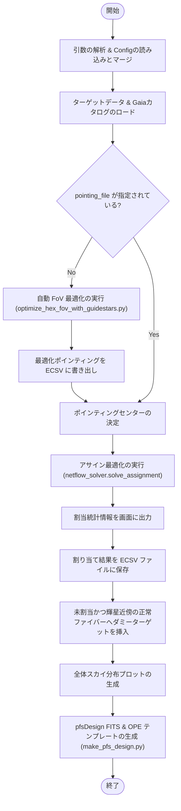

# PFSファイバーアサイン統合パイプライン解説
(`run_netflow.py` の動作とアルゴリズム)

本ドキュメントでは、[run_netflow.py](file:///mnt/ugnas/work/PFS/galuda/netflow/src/netflow_by_user/run_netflow.py) の処理フロー、アルゴリズム、および各ステップの役割について詳しく解説します。

---

## 1. 概要
`run_netflow.py` は、PFS（Prime Focus Spectrograph）の観測準備における**ファイバー割り当て（アサイン）最適化計算**から、観測用制御ファイル（`pfsDesign` FITS ファイルおよび OPE テンプレート）の自動生成までをエンドツーエンドで実行するパイプラインスクリプトです。

Gurobi 数理計画ソルバーを用いたネットワークフロー最適化を行い、観測効率が最大になるように各天体にファイバーを割り当てます。

---

## 2. 全体ワークフロー

パイプライン全体の処理フローは以下の通りです。

---

## 3. 各処理ステップの解説

### ステップ 1: 構成ファイルの読み込みとマージ
1. デフォルトの設定ファイル `netflow_pipeline_config.yaml`（または `-c` 引数で指定された YAML）を読み込みます。
2. もし `--config-yaml`（デフォルト: `config.yaml`）が存在する場合、その中から Gurobi 関連のパラメータ (`gurobi.param`) や PFS 特有のパラメータ (`pfs`) を読み込み、メインの設定ファイルにマージ（オーバーライド）します。これによって観測ランごとの微調整を容易にしています。

### ステップ 2: ターゲットデータの読み込み
* 科学天体リスト（Science Targets）、ファイバーの相対フラット補正等に用いるキャリブレーション星（Flux Standard Stars）、背景光測定用のスカイ位置（Sky Positions）の 3 種類の位置リストを [netflow_io.load_all_targets](file:///mnt/ugnas/work/PFS/galuda/netflow/src/netflow_by_user/netflow_io.py) を使用してロードします。
* Flux Standard 星については、設定された等級範囲 (`fluxstd.mag_min` 〜 `mag_max`) にフィルタリングされます。

### ステップ 3: ポインティング自動最適化（必要な場合のみ）
* 構成ファイルで `pointing_file` が指定されていない（`null` の）場合、自動ポインティング最適化モードが起動します。
* [optimize_hex_fov_with_guidestars.py](file:///mnt/ugnas/work/PFS/galuda/netflow/src/netflow_by_user/optimize_hex_fov_with_guidestars.py) の最適化アルゴリズムを呼び出し、天体カバレッジとガイド星制約を同時に満たす最適なポインティングを算出します。
* 算出されたポインティングは `optimized_pointings.ecsv` に自動保存され、後続ステップで読み込まれます。

### ステップ 4: ファイバーアサイン最適化の実行
* [netflow_solver.solve_assignment](file:///mnt/ugnas/work/PFS/galuda/netflow/src/netflow_by_user/netflow_solver.py) を呼び出し、Gurobi 数理計画ソルバーを用いてネットワークフロー（整数線形計画問題）を解きます。
* 科学天体の優先度（Priority）、キャリブレーション星・スカイ用の最低必要ファイバー数、ファイバー同士の衝突回避、およびコブラ（Cobra）アクチュエータの可動範囲（パトロール領域）の制約をすべて考慮し、最適な割り当てを瞬時に計算します。

### ステップ 5: 統計出力と結果の保存
* 露出（Exposure / Visit）ごとに、各カテゴリー（優先度ごとの科学天体、Cal星、Sky）のファイバー割り当て統計テーブルを標準出力に表示します。
* 割り当てられた結果をもとに、露出ごとにどのファイバーがどの天体を観測するかを対応付けた ECSV ファイルをターゲットディレクトリに保存します。

### ステップ 6: 輝星近傍の未割当ファイバーへのダミーターゲット挿入
* 正常かつ未割り当てのファイバーが輝星の近くに放置されるのを防ぐため、ダミーターゲットを挿入してファイバーを輝星から安全な位置へと退避させます（詳細は後述）。

### ステップ 7: 成果物（pfsDesign FITS & OPE）の生成
* 最終的に、すべての露出におけるファイバー割り当て定義を含む、観測制御用の標準 FITS フォーマットである `pfsDesign` ファイルと、望遠鏡・装置制御用の OPE スクリプトを [make_pfs_design.py](file:///mnt/ugnas/work/PFS/galuda/netflow/src/netflow_by_user/make_pfs_design.py) を通じて自動生成・検証します。

---

## 4. ダミーターゲット回避アルゴリズム (Dummy Target Avoidance)

PFS の観測では、**正常かつ未割り当て（Unassigned）のファイバー**が放置され、その近くに明るい星 ($G \le 12.0$ 等) があると、ファイバー内に不要な強い光が入り込んでスペクトルの汚染や装置への悪影響が生じます。

これを防ぐため、`add_dummy_targets_for_unassigned_near_bright_stars` 関数を用いて、対象ファイバーを輝星から「最も離れた安全な位置」へ移動させるためのダミーターゲットを生成・挿入します。

### 回避アルゴリズムの詳細
1. **正常かつ未割当ファイバーの検出**:
   * ベンチ内の正常なコブラ (`isGood` が `True`) のうち、最適化で天体がアサインされなかったコブラをリストアップ。
2. **天球座標への逆投影**:
   * 検出されたコブラの物理中心位置（PFI焦点面座標）を、天球上の RA, Dec に変換。
3. **近傍輝星の検索**:
   * Gaia カタログの星のうち、ポインティング中心から $0.8^\circ$ 以内にある $G \le$ `bright_star_mag_limit` の星を抽出。
   * コブラ座標と輝星との角距離を計算し、`bright_star_radius_arcmin` (デフォルト $1.5\ \text{arcmin}$) 以内に輝星が存在するコブラを特定。
4. **最適な退避位置のグリッドサーチ**:
   * コブラのパトロール領域（可動動径 $r_{\text{min}}$ から $r_{\text{max}}$ の間）の中で、**輝星の位置から真反対の角度**を中心とした周囲の極座標格子を探索。
   * 隣接する他のファイバー（アサイン済みの天体または隣のコブラ中心）と衝突しないこと（距離 $\ge 2.0\ \text{mm}$）を絶対条件とし、**輝星からの距離が最大**となる物理座標を算出。
   * 衝突を回避できる座標が見つからない場合は、フォールバックとしてコブラの物理中心を採用。
5. **ダミーターゲットの登録と保存**:
   * 退避位置に対応する天球座標 (RA, Dec) を逆算し、優先度 4 (`priority=4`) の「ダミーターゲット」としてサイエンスターゲットリスト (ECSV) の末尾に追記。
   * 各ファイバーの初期位置（コブラ中心）から退避後の最終位置への移動量や距離の差を記載した `dummy_target_improvements.txt` レポートを出力。
   * 回避の様子を可視化したコブラ周辺図（パトロール領域、隣接ファイバー、輝星、移動を示す矢印などを描画）を `science/dummy_plots_{pointing_code}/cobra_{id}.png` に保存。

---

## 5. 構成ファイルのパラメータ対応表

パイプライン全体の挙動を制御する主要なパラメータ設定項目です。

| パラメータ名 | 記述箇所 (YAML) | デフォルト値 | 説明 |
| :--- | :--- | :--- | :--- |
| `nvisit` | `netflow.nvisit` | (必須) | 観測する露出（Visit / ポインティング）の数 |
| `num_fields` | `netflow.num_fields` | `1` | 自動 FoV 最適化時に生成する視野の総数 |
| `random_seed` | `netflow.random_seed` | `42` | 最適化エンジン等の乱数シード値 |
| `pointing_file` | `inputs.pointing_file` | `null` | ポインティング情報を定義したECSVパス。`null` の場合自動最適化が起動 |
| `gaia_catalog` | `inputs.gaia_catalog` | `cosmos/gaia.ecsv` | ガイド星および輝星回避チェック用のGaiaカタログ |
| `bright_star_mag_limit` | `netflow.bright_star_mag_limit` | `12.0` | 故障ファイバーおよびダミーターゲット回避で輝星とみなす閾値等級 (G) |
| `bright_star_radius_arcmin`| `netflow.bright_star_radius_arcmin` | `1.5` | 輝星とコブラの回避必要半径 (arcmin) |
| `collision_distance` | `netflow.collision_distance` | `2.0` | ファイバー先端同士の最小許容距離 (mm) |
| `black_dot_radius_margin` | `pfs.black_dot_radius_margin` | `1.65` | ファイバー先端と中心のブラックドット等の干渉マージン (mm) |

<!-- Mermaid JS rendering support -->

<!-- MathJax JS rendering support -->

