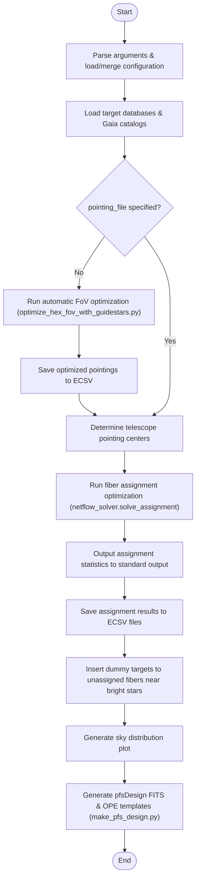

# PFS Fiber Assignment Integration Pipeline Explanation
(Behavior and Algorithm of `run_netflow.py`)

This document provides a detailed explanation of the workflow, algorithm, and processing steps in [run_netflow.py](file:///mnt/ugnas/work/PFS/galuda/netflow/src/netflow_by_user/run_netflow.py).

---

## 1. Overview
`run_netflow.py` is the main integration pipeline script for PFS (Prime Focus Spectrograph) observation planning. It automates the entire process from **fiber assignment optimization** using the Gurobi linear programming solver, to the generation and verification of observation control files (`pfsDesign` FITS files and OPE templates).

The pipeline uses network flow optimization to maximize overall observation efficiency by assigning fiber positioners to targets.

---

## 2. Overall Workflow

The overall processing sequence is illustrated below:

---

## 3. Processing Steps

### Step 1: Load and Merge Configurations
1. Reads the default configuration file `netflow_pipeline_config.yaml` (or the YAML path provided via the `-c` argument).
2. If `--config-yaml` (default: `config.yaml`) exists, it reads Gurobi engine settings (`gurobi.param`) and PFS specific parameters (`pfs`) and overrides/merges them into the main pipeline configuration. This enables easy, run-specific parameter overriding.

### Step 2: Load Target Catalogs
* Loads three target catalogs using [netflow_io.load_all_targets](file:///mnt/ugnas/work/PFS/galuda/netflow/src/netflow_by_user/netflow_io.py): Science Targets, Calibration Stars (Flux Standards), and background Sky Positions.
* Calibration stars are filtered to include only those within the specified magnitude range (`fluxstd.mag_min` to `mag_max`).

### Step 3: Automatic FoV Optimization (If Required)
* If `pointing_file` is set to `null` in the configuration, the automatic pointing optimization module is triggered.
* It invokes [optimize_hex_fov_with_guidestars.py](file:///mnt/ugnas/work/PFS/galuda/netflow/src/netflow_by_user/optimize_hex_fov_with_guidestars.py) to calculate optimal pointing coordinates and PAs that satisfy both target coverage and guide star requirements.
* The optimized pointings are saved to `optimized_pointings.ecsv` and used in subsequent steps.

### Step 4: Run Fiber Assignment Optimization
* Solves the fiber allocation network flow model using Gurobi via [netflow_solver.solve_assignment](file:///mnt/ugnas/work/PFS/galuda/netflow/src/netflow_by_user/netflow_solver.py).
* The solver factors in target priority weights (with Priority 0 being the highest), required calibration and sky fiber counts, fiber positioner hardware limits (Cobra patrol regions), and collision constraints.

### Step 5: Output Statistics & Save Results
* Displays a summary table of fiber assignments per exposure (Science target counts by priority, Calibration stars, and Sky fibers) on standard output.
* Saves individual exposure target-fiber mapping tables to ECSV files in the outputs directory.

### Step 6: Insert Dummy Targets for Unassigned Fibers Near Bright Stars
* Healthy fiber positioners that are unassigned and located close to bright stars are moved to safe configurations by inserting dummy targets (see details below).

### Step 7: Generate Deliverables (pfsDesign FITS & OPE)
* Executes [make_pfs_design.py](file:///mnt/ugnas/work/PFS/galuda/netflow/src/netflow_by_user/make_pfs_design.py) to construct the final `pfsDesign` FITS files and OPE control scripts, verifying them for instrument safety.

---

## 4. Dummy Target Avoidance Algorithm

During PFS observations, if a healthy fiber positioner is left **unassigned** and parked near a bright star ($G \le 12.0$), it will collect excessive stray light, corrupting adjacent spectra or saturating detectors.

The pipeline resolves this by finding the safest "furthest" position within the fiber's patrol region and placing a "dummy target" there to drive the fiber positioner away from the star.

### Avoidance Logic
1. **Identify Unassigned Healthy Fibers**: Filters for cobras that are healthy (`isGood = True`) but did not receive a science target or calibration/sky assignment in the solver.
2. **Reverse Projection to Sky**: Converts the physical centers of these unassigned fibers (PFI coordinates) to sky coordinates (RA, Dec).
3. **Identify Neighboring Bright Stars**: Finds Gaia stars within $0.8^\circ$ of the pointing center that are brighter than `bright_star_mag_limit` (default: 12.0). If a bright star is within `bright_star_radius_arcmin` (default: $1.5\ \text{arcmin}$) of the fiber center, the fiber is flagged for avoidance.
4. **Grid Search for Safe Parking Positions**:
   * Scans a polar coordinate grid inside the cobra's patrol region ($r_{\text{min}}$ to $r_{\text{max}}$), focusing on the **opposite direction** of the bright star.
   * Ensures the test position does not collide with neighboring fibers (keeps a distance $\ge 2.0\ \text{mm}$).
   * Selects the coordinates that **maximize the distance** to the bright star. Falls back to the cobra center if no safe position is found.
5. **Dummy Target Registration**:
   * Converts the safe position back to sky coordinates (RA, Dec) and appends it to the science target catalog as a dummy target (`priority=4`, code starting with `dummy_`, ID in `999000000+cidx`).
   * Writes distance improvements to `dummy_target_improvements.txt`.
   * Generates diagnostic plots showing the fiber patrol limits, neighbor positioners, bright star location, and the movement vector. These are saved to `science/dummy_plots_{pointing_code}/cobra_{id}.png`.

---

## 5. YAML Configuration Key Reference

Key configuration settings and parameters.

| YAML Key | Default | Description |
| :--- | :--- | :--- |
| `netflow.nvisit` | (Required) | Number of exposures (visits/pointings) |
| `netflow.num_fields` | `1` | Total number of fields for automatic FoV optimization |
| `netflow.random_seed` | `42` | Random seed for optimization algorithms |
| `inputs.pointing_file` | `null` | Path to the input pointings ECSV file. If `null`, automatic optimization is run |
| `inputs.gaia_catalog` | `cosmos/gaia.ecsv` | Gaia star catalog for guide stars and bright star avoidance |
| `netflow.bright_star_mag_limit` | `12.0` | Magnitude limit (G) for avoiding bright stars |
| `netflow.bright_star_radius_arcmin`| `1.5` | Avoidance radius (arcmin) around fibers |
| `netflow.collision_distance` | `2.0` | Minimum allowed distance (mm) between fiber tips |
| `pfs.black_dot_radius_margin` | `1.65` | Safety margin (mm) to avoid central black dots on positioners |
